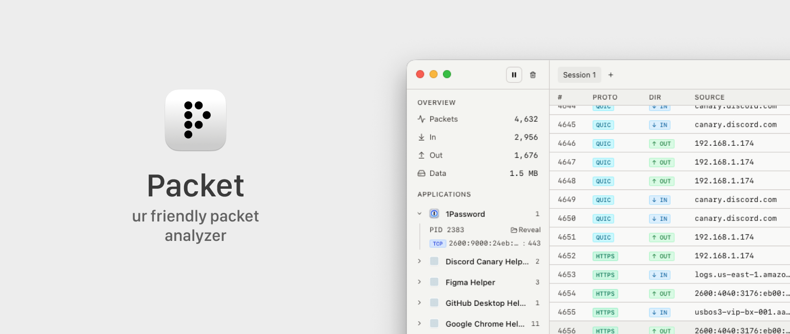

<p align="center">
  
</p>

<p align="center">
  <b>ur friendly packet analyzer</b>
  <br />
  a macOS app for capturing and analyzing network traffic.
</p>

<p align="center">
  <a href="https://github.com/usepacket/packet/releases/latest"></a>
  <a href="https://github.com/usepacket/packet/releases/latest"></a>
  <a href="https://usepacket.dev"></a>
</p>

---

## What is Packet?

Packet is a lightweight, native-feeling network analyzer built for macOS. It lets you capture, inspect, and export network traffic in real time — all from a clean, modern interface.

No terminal commands. No config files. Just open the app and start capturing.

## Features

### Free

- **Live packet capture** — start, pause, and clear captures on any network interface
- **Packet inspection** — view source/destination, protocol, hex dump, ASCII payload, and metadata
- **Session management** — create multiple capture sessions, rename and switch between them
- **Search & filter** — quickly find packets by protocol, address, or content
- **Follow tail** — auto-scroll to keep up with incoming traffic
- **Auto-updates** — always stay on the latest version

### Pro

- **Unlimited capture** — free tier caps at 500 packets per session, pro removes the limit
- **PCAP export** — save your captures to `.pcap` files for use in other tools
- **PCAP import** — load existing `.pcap` / `.pcapng` files for analysis
- **App tracking** — see which applications are making network connections in real time, with icons, PIDs, and connection details

## Installation

### Download

Grab the latest `.dmg` from the [Releases](https://github.com/usepacket/packet/releases/latest) page.

| Chip | Download |
|------|----------|
| Apple Silicon (M1+) | `Packet_x.x.x_aarch64.dmg` |
| Intel | `Packet_x.x.x_x64.dmg` |

### BPF Permissions

Packet needs read access to the Berkeley Packet Filter devices to capture traffic. Run this once after installing:

```bash
sudo chmod o+r /dev/bpf*
```

> [!NOTE]
> The app will prompt you if this hasn't been set up yet.

## Purchasing a License

Packet works out of the box for basic capture and inspection. To unlock pro features (unlimited capture, PCAP import/export, app tracking), you can purchase a license at [usepacket.dev](https://usepacket.dev).

After purchasing, you'll receive a license key. Activate it in-app via the sidebar or through the activation modal.

## System Requirements

- **macOS** (Intel or Apple Silicon)
- One-time BPF permission setup (see above)

## Feedback & Issues

Found a bug or have a feature request? [Open an issue](https://github.com/usepacket/packet/issues) — we'd love to hear from you.
